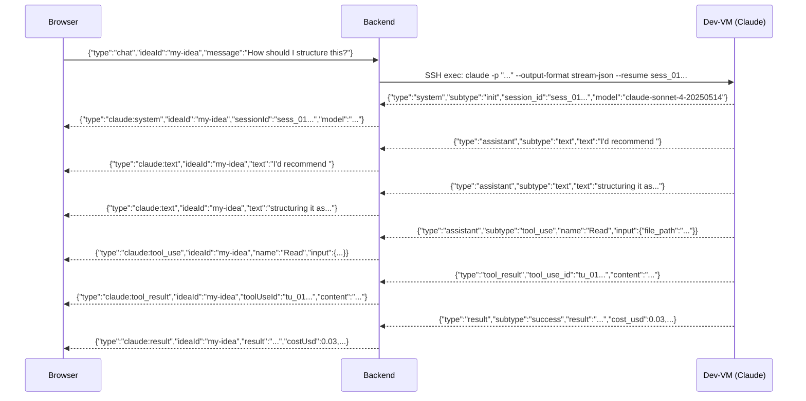

# WebSocket Protocol

Catalyst uses a WebSocket connection for real-time, bidirectional communication between the browser and the backend during Claude Code sessions. This page documents the connection lifecycle, authentication, and all message types.

## Connection

### URL

```
ws://localhost:3000/ws     (development, through Vite proxy)
ws://localhost:3001/ws     (development, direct to backend)
wss://catalyst.local/ws    (production, through ingress)
```

The frontend automatically selects `ws:` or `wss:` based on the page protocol:

```typescript
const protocol = window.location.protocol === 'https:' ? 'wss:' : 'ws:';
const ws = new WebSocket(`${protocol}//${window.location.host}/ws`);
```

### Authentication

WebSocket authentication happens during the HTTP upgrade handshake. The backend extracts and verifies the signed `catalyst_session` cookie from the upgrade request headers.

**If authentication succeeds:** The upgrade completes normally (HTTP 101 Switching Protocols).

**If authentication fails:** The server responds with HTTP 401 and destroys the socket:

```
HTTP/1.1 401 Unauthorized
```

No WebSocket connection is established.

!!! note
    The browser's WebSocket API does not allow setting custom headers. Authentication relies entirely on the cookie, which the browser sends automatically with the upgrade request.

### Auto-Reconnect

The frontend's `useWebSocket` hook implements automatic reconnection with exponential backoff:

- **Initial delay:** 1 second
- **Backoff multiplier:** 2x
- **Maximum delay:** 30 seconds
- **Reset:** The retry counter resets to 0 on a successful connection

The connection status is tracked and displayed via the `ConnectionIndicator` component.

## Message Format

All messages (both directions) are JSON-encoded strings. Each message has a `type` field that determines its structure.

## Client Messages (Browser to Server)

The client sends three types of messages, all including an `ideaId` for routing:

### `chat`

Start or continue a chat session with Claude. Claude is restricted to read-only tools (`Read`, `Grep`, `Glob`).

```json
{
  "type": "chat",
  "ideaId": "my-cool-idea",
  "message": "What tech stack would work best for this?"
}
```

| Field | Type | Description |
|-------|------|-------------|
| `type` | `"chat"` | Message type identifier |
| `ideaId` | string | The idea's slug or ID |
| `message` | string | The message to send to Claude |

### `build`

Trigger build mode. Claude gets full tool access and works in the idea's `project/` directory.

```json
{
  "type": "build",
  "ideaId": "my-cool-idea",
  "instructions": "Build this project based on our discussion. Create all necessary files."
}
```

| Field | Type | Description |
|-------|------|-------------|
| `type` | `"build"` | Message type identifier |
| `ideaId` | string | The idea's slug or ID |
| `instructions` | string | Build instructions for Claude |

### `cancel`

Cancel the currently running Claude session for an idea.

```json
{
  "type": "cancel",
  "ideaId": "my-cool-idea"
}
```

| Field | Type | Description |
|-------|------|-------------|
| `type` | `"cancel"` | Message type identifier |
| `ideaId` | string | The idea's slug or ID |

The backend sends `SIGINT` to the SSH channel, followed by `SIGKILL` after 5 seconds if the process is still running.

## Server Messages (Server to Browser)

The server sends six types of messages, all including an `ideaId` for client-side routing:

### `claude:system`

Sent once at the start of a Claude session. Contains the session ID and model.

```json
{
  "type": "claude:system",
  "ideaId": "my-cool-idea",
  "sessionId": "sess_01J5XYZ...",
  "model": "claude-sonnet-4-20250514"
}
```

| Field | Type | Description |
|-------|------|-------------|
| `type` | `"claude:system"` | Message type identifier |
| `ideaId` | string | The idea this session belongs to |
| `sessionId` | string | Claude's session ID, used for resumption |
| `model` | string | The Claude model being used |

When the frontend receives this message, it sets the `streaming` state to `true` and clears the stream buffer.

### `claude:text`

A chunk of text from Claude's response. These arrive incrementally as Claude generates tokens.

```json
{
  "type": "claude:text",
  "ideaId": "my-cool-idea",
  "text": "Here's my analysis of "
}
```

| Field | Type | Description |
|-------|------|-------------|
| `type` | `"claude:text"` | Message type identifier |
| `ideaId` | string | The idea this response belongs to |
| `text` | string | A text chunk (may be a partial word, sentence, or paragraph) |

The frontend accumulates these chunks in a `streamBuffer` state variable and renders them with Markdown formatting as they arrive.

### `claude:tool_use`

Claude is invoking a tool. Sent before the tool executes.

```json
{
  "type": "claude:tool_use",
  "ideaId": "my-cool-idea",
  "toolUseId": "tu_01ABC...",
  "name": "Read",
  "input": {
    "file_path": "/home/user/project/src/index.ts"
  }
}
```

| Field | Type | Description |
|-------|------|-------------|
| `type` | `"claude:tool_use"` | Message type identifier |
| `ideaId` | string | The idea this tool use belongs to |
| `toolUseId` | string | Unique identifier for this tool invocation |
| `name` | string | Tool name (e.g., `Read`, `Grep`, `Glob`, `Write`, `Bash`) |
| `input` | object | Tool input parameters (varies by tool) |

The frontend adds an entry to the tool activity panel. Tool activities are collapsible and show both the input and result.

### `claude:tool_result`

The result of a tool execution, matched to a previous `tool_use` by `toolUseId`.

```json
{
  "type": "claude:tool_result",
  "ideaId": "my-cool-idea",
  "toolUseId": "tu_01ABC...",
  "content": "import express from 'express';\nimport { config } from './config.js';\n..."
}
```

| Field | Type | Description |
|-------|------|-------------|
| `type` | `"claude:tool_result"` | Message type identifier |
| `ideaId` | string | The idea this result belongs to |
| `toolUseId` | string | Matches the `toolUseId` from the corresponding `tool_use` message |
| `content` | string | The tool's output (file contents, search results, command output, etc.) |

### `claude:result`

Sent once at the end of a Claude interaction. Contains the final result, session ID, and usage metrics.

```json
{
  "type": "claude:result",
  "ideaId": "my-cool-idea",
  "result": "I've completed the analysis. Here's a summary...",
  "sessionId": "sess_01J5XYZ...",
  "costUsd": 0.042,
  "durationMs": 15234,
  "turns": 3
}
```

| Field | Type | Description |
|-------|------|-------------|
| `type` | `"claude:result"` | Message type identifier |
| `ideaId` | string | The idea this result belongs to |
| `result` | string? | The final response text (present on success) |
| `error` | string? | Error description (present on failure) |
| `sessionId` | string | The session ID for resumption |
| `costUsd` | number | Total cost of this interaction in USD |
| `durationMs` | number | Total duration in milliseconds |
| `turns` | number | Number of conversational turns |

When the frontend receives this message, it:

1. Adds the accumulated `streamBuffer` (or the `result` field) as an assistant message.
2. Clears the stream buffer and sets `streaming` to `false`.
3. Refetches the idea metadata to pick up any status changes.

### `claude:error`

An error occurred during the Claude interaction.

```json
{
  "type": "claude:error",
  "ideaId": "my-cool-idea",
  "error": "SSH connection failed"
}
```

| Field | Type | Description |
|-------|------|-------------|
| `type` | `"claude:error"` | Message type identifier |
| `ideaId` | string | The idea that encountered the error |
| `error` | string | Human-readable error description |

Common errors:

- `"Idea not found: <id>"` -- The idea does not exist on the dev-VM
- `"SSH connection failed"` -- Cannot connect to the dev-VM
- `"SSH connection pool exhausted"` -- All connections are busy
- `"Claude process timed out (no output for 10 minutes)"` -- Inactivity timeout
- `"Chat failed"` / `"Build failed"` -- Generic catch-all errors

## Message Flow Example

Here is a complete message flow for a chat interaction:



## Multiplexing

All messages include an `ideaId` field. The frontend filters incoming messages by the current idea's ID or slug:

```typescript
const onMessage = useCallback((msg: WsServerMessage) => {
  if ('ideaId' in msg && msg.ideaId !== idea?.id && msg.ideaId !== idea?.slug) return;
  // Handle message...
}, [idea?.id, idea?.slug]);
```

This allows a single WebSocket connection to handle multiple ideas, though in practice a user typically works on one idea at a time.

## Type Definitions

All message types are defined in `packages/shared/src/index.ts`:

```typescript
// Client -> Server
export type WsClientMessage = WsChatMessage | WsBuildMessage | WsCancelMessage;

// Server -> Client
export type WsServerMessage =
  | WsClaudeSystemMessage
  | WsClaudeTextMessage
  | WsClaudeToolUseMessage
  | WsClaudeToolResultMessage
  | WsClaudeResultMessage
  | WsClaudeErrorMessage;
```
