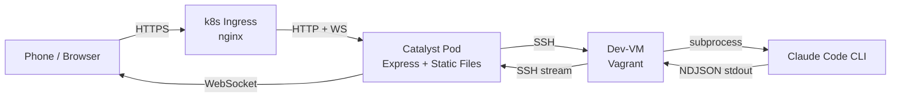
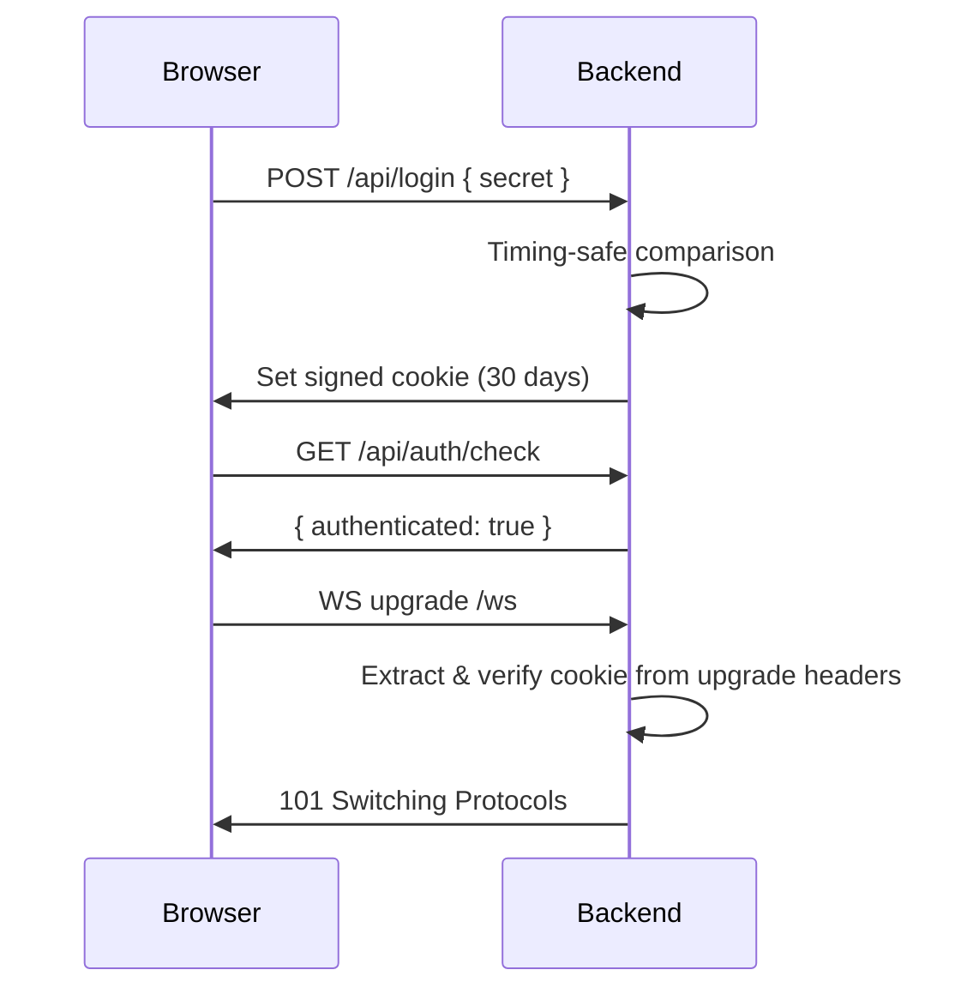

# Architecture Overview

Catalyst is a full-stack TypeScript application with a clear separation between its frontend, backend, and the external Claude Code process. This page describes the high-level architecture and how the pieces fit together.

## System Diagram



The data flow for a typical chat interaction:

1. The user types a message in the browser.
2. The frontend sends a JSON message over WebSocket to the backend.
3. The backend opens an SSH channel to the dev-VM and executes the `claude` CLI with the message.
4. Claude Code runs, producing NDJSON output on stdout.
5. The backend reads the NDJSON stream over the SSH channel, parses each line, and translates it into WebSocket messages.
6. The frontend receives these messages and renders text, tool activity, and results in real time.

## Package Architecture

Catalyst is organized as a Bun workspace monorepo with three packages:

```
catalyst/
  packages/
    shared/     # TypeScript types shared between frontend and backend
    backend/    # Express server, SSH service, Claude service, WebSocket handler
    frontend/   # React SPA with Vite, zustand, and shadcn/ui
```

### @catalyst/shared

Contains all TypeScript interfaces and type definitions used by both sides:

- **Idea types** -- `IdeaMeta`, `Idea`, `IdeaStatus`
- **Claude stream message types** -- `ClaudeSystemInit`, `ClaudeAssistantText`, `ClaudeToolUse`, `ClaudeToolResult`, `ClaudeResult`
- **WebSocket protocol types** -- `WsClientMessage` (chat, build, cancel) and `WsServerMessage` (claude:system, claude:text, etc.)
- **API response types** -- `ApiResponse<T>`, `AuthCheckResponse`, `HealthResponse`

This package has no runtime dependencies. It is imported directly from source (`./src/index.ts`) by both the backend and frontend.

### @catalyst/backend

The Express server that handles:

- **Authentication** -- Shared secret login, signed cookie sessions, in-memory token store
- **REST API** -- CRUD operations on ideas (via SSH filesystem commands on the dev-VM)
- **WebSocket server** -- Real-time bidirectional communication for Claude interactions
- **SSH connection pooling** -- Manages a pool of persistent SSH connections to the dev-VM
- **Claude orchestration** -- Invokes `claude` CLI over SSH, parses NDJSON output, relays events

### @catalyst/frontend

A React 18 SPA built with Vite:

- **Pages** -- Login, Dashboard, Capture, Session
- **State management** -- zustand stores for auth and connection status
- **Real-time** -- Custom `useWebSocket` hook with auto-reconnect and exponential backoff
- **UI** -- Tailwind CSS 4 with shadcn/ui components, Markdown rendering with syntax highlighting

## Authentication Flow

Catalyst uses a single shared secret for authentication, appropriate for a personal single-user application:



The session token is a random 32-byte hex string stored in an `httpOnly`, `signed`, `secure` (in production), `sameSite: strict` cookie. The token is held in an in-memory `Set` on the backend. This means sessions do not survive server restarts, which is acceptable for a single-user app.

WebSocket authentication happens during the HTTP upgrade. The backend manually parses and unsigns the cookie from the `Upgrade` request headers, since Express middleware does not run on WebSocket upgrades.

## Idea Lifecycle

Each idea progresses through four statuses:

| Status | Description | Claude Tools Available |
|--------|------------|----------------------|
| `captured` | Idea has been created but no Claude interaction yet | -- |
| `chatting` | User is refining the idea with Claude | `Read`, `Grep`, `Glob` (read-only) |
| `building` | Claude is building the project with full tool access | All tools |
| `done` | Build complete | -- |

The status transitions are managed by the backend. When the user sends a `chat` message, the status moves from `captured` to `chatting`. When they send a `build` message, it moves to `building`. The transition to `done` is not currently automated -- it can be set via the PATCH endpoint.

## Network Security

In the Kubernetes deployment, a `NetworkPolicy` restricts the Catalyst pod's traffic:

- **Ingress** -- Only from the ingress-nginx namespace
- **Egress** -- DNS (port 53) and SSH to the dev-VM (configurable CIDR)

This means the pod cannot make arbitrary outbound connections. It can only resolve DNS and reach the dev-VM over SSH.
