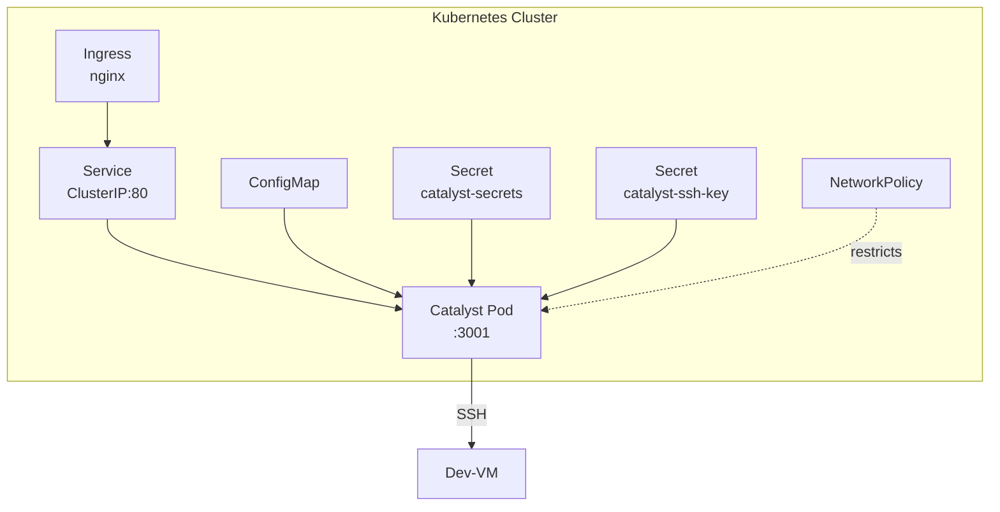

# Kubernetes Deployment

Catalyst includes a Helm chart for deployment to a Kubernetes cluster. This is the recommended deployment method for production use on a local cluster behind a VPN.

## Prerequisites

- A Kubernetes cluster with `kubectl` configured
- An nginx ingress controller installed (e.g., `ingress-nginx`)
- Helm 3 installed
- The Catalyst container image available (either built locally or pulled from GHCR)
- DNS or `/etc/hosts` configured to resolve your chosen hostname to the ingress controller

## Architecture in Kubernetes



The Helm chart creates:

- **Namespace** (uses the release namespace)
- **Deployment** with one replica
- **Service** (ClusterIP on port 80, targeting port 3001)
- **Ingress** with nginx annotations for WebSocket support
- **ConfigMap** with SSH connection settings
- **Secret** for `CATALYST_SECRET` and `COOKIE_SECRET` (optional, can use pre-existing)
- **NetworkPolicy** restricting ingress to the nginx namespace and egress to DNS + SSH

## Quick Start

### 1. Create the Namespace

```bash
kubectl create namespace catalyst
```

### 2. Create Secrets

Catalyst expects two secrets. It is recommended to create them manually rather than having the chart manage them:

```bash
# Application secrets
kubectl create secret generic catalyst-secrets \
  --from-literal=CATALYST_SECRET="$(openssl rand -hex 32)" \
  --from-literal=COOKIE_SECRET="$(openssl rand -hex 32)" \
  -n catalyst

# SSH private key
kubectl create secret generic catalyst-ssh-key \
  --from-file=id_ed25519=~/.ssh/catalyst_ed25519 \
  -n catalyst
```

### 3. Create a Values Override

Create a `values-prod.yaml` file:

```yaml
image:
  repository: ghcr.io/your-org/catalyst
  tag: main
  pullPolicy: Always

ingress:
  enabled: true
  className: nginx
  host: catalyst.yourdomain.com

ssh:
  host: "192.168.1.100"
  port: "22"
  user: "vagrant"
  ideasBasePath: "~/catalyst/ideas"
  existingKeySecret: "catalyst-ssh-key"

secrets:
  useExisting: true
```

### 4. Install the Chart

=== "From local chart"

    ```bash
    helm install catalyst ./chart \
      -f values-prod.yaml \
      -n catalyst
    ```

=== "From GHCR OCI registry"

    ```bash
    helm install catalyst oci://ghcr.io/your-org/charts/catalyst \
      -f values-prod.yaml \
      -n catalyst
    ```

### 5. Verify the Deployment

```bash
# Check pod status
kubectl get pods -n catalyst

# Check the deployment rollout
kubectl rollout status deployment/catalyst -n catalyst

# View the Helm notes
helm get notes catalyst -n catalyst

# Test the health endpoint
kubectl port-forward svc/catalyst 8080:80 -n catalyst
curl http://localhost:8080/api/health
```

## Upgrading

When a new image is available:

```bash
helm upgrade catalyst ./chart \
  -f values-prod.yaml \
  -n catalyst \
  --set image.tag=v1.2.3
```

Or if using the OCI registry:

```bash
helm upgrade catalyst oci://ghcr.io/your-org/charts/catalyst \
  -f values-prod.yaml \
  -n catalyst
```

## Ingress Configuration

The chart configures the nginx ingress with annotations for WebSocket support. These are critical for real-time Claude streaming:

```yaml
ingress:
  annotations:
    nginx.ingress.kubernetes.io/proxy-read-timeout: "3600"
    nginx.ingress.kubernetes.io/proxy-send-timeout: "3600"
    nginx.ingress.kubernetes.io/proxy-connect-timeout: "60"
    nginx.ingress.kubernetes.io/websocket-services: "catalyst"
    nginx.ingress.kubernetes.io/proxy-http-version: "1.1"
    nginx.ingress.kubernetes.io/configuration-snippet: |
      proxy_set_header Upgrade $http_upgrade;
      proxy_set_header Connection "upgrade";
```

The long timeouts (3600 seconds = 1 hour) are necessary because Claude sessions can run for extended periods during builds.

## Network Policy

When `networkPolicy.enabled` is `true` (the default), the chart creates a `NetworkPolicy` that:

**Allows ingress from:**

- The ingress-nginx namespace only (configurable via `networkPolicy.ingressNamespace`)

**Allows egress to:**

- DNS (port 53, UDP and TCP) in any namespace
- SSH (configurable port) to the dev-VM (configurable CIDR via `networkPolicy.sshEgressCidr`)

This prevents the Catalyst pod from making any other outbound connections.

```yaml
networkPolicy:
  enabled: true
  ingressNamespace: ingress-nginx
  sshEgressCidr: "192.168.1.0/24"  # Restrict to your dev-VM's subnet
```

!!! tip
    Set `sshEgressCidr` to the narrowest CIDR that covers your dev-VM's IP. The default `0.0.0.0/0` is permissive and should be tightened in production.

## Health Probes

The chart configures both liveness and readiness probes against the `/api/health` endpoint:

```yaml
livenessProbe:
  httpGet:
    path: /api/health
    port: 3001
  initialDelaySeconds: 10
  periodSeconds: 30

readinessProbe:
  httpGet:
    path: /api/health
    port: 3001
  initialDelaySeconds: 5
  periodSeconds: 10
```

The health endpoint checks SSH connectivity. If the dev-VM becomes unreachable, the readiness probe will fail and Kubernetes will stop routing traffic to the pod. The liveness probe will eventually restart the pod if SSH remains unavailable.

## Resource Limits

Default resource requests and limits:

```yaml
resources:
  requests:
    memory: "128Mi"
    cpu: "100m"
  limits:
    memory: "512Mi"
    cpu: "500m"
```

Catalyst is lightweight since Claude Code runs on the dev-VM, not in the pod. The pod primarily proxies WebSocket traffic and manages SSH connections. These defaults are suitable for most setups.

## Troubleshooting

### Pod is in CrashLoopBackOff

Check the logs:

```bash
kubectl logs -n catalyst deployment/catalyst
```

Common causes:

- Missing secrets (`catalyst-secrets` or `catalyst-ssh-key` not created)
- Invalid SSH key format

### Pod is running but not ready

The readiness probe is failing, likely because SSH connectivity is down:

```bash
kubectl exec -n catalyst deployment/catalyst -- curl -s localhost:3001/api/health
```

Check that the dev-VM is reachable from the pod:

```bash
kubectl exec -n catalyst deployment/catalyst -- nc -zv <SSH_HOST> <SSH_PORT>
```

### WebSocket connection fails

Verify the ingress annotations are applied:

```bash
kubectl get ingress -n catalyst catalyst -o yaml
```

Check that the nginx ingress controller supports WebSocket (it does by default, but the annotations must be present).

### TLS

The chart does not configure TLS by default. If your cluster uses cert-manager, you can add TLS configuration to the ingress annotations in your values override. Since Catalyst should be behind a VPN, TLS may not be strictly necessary, but it is still recommended.
